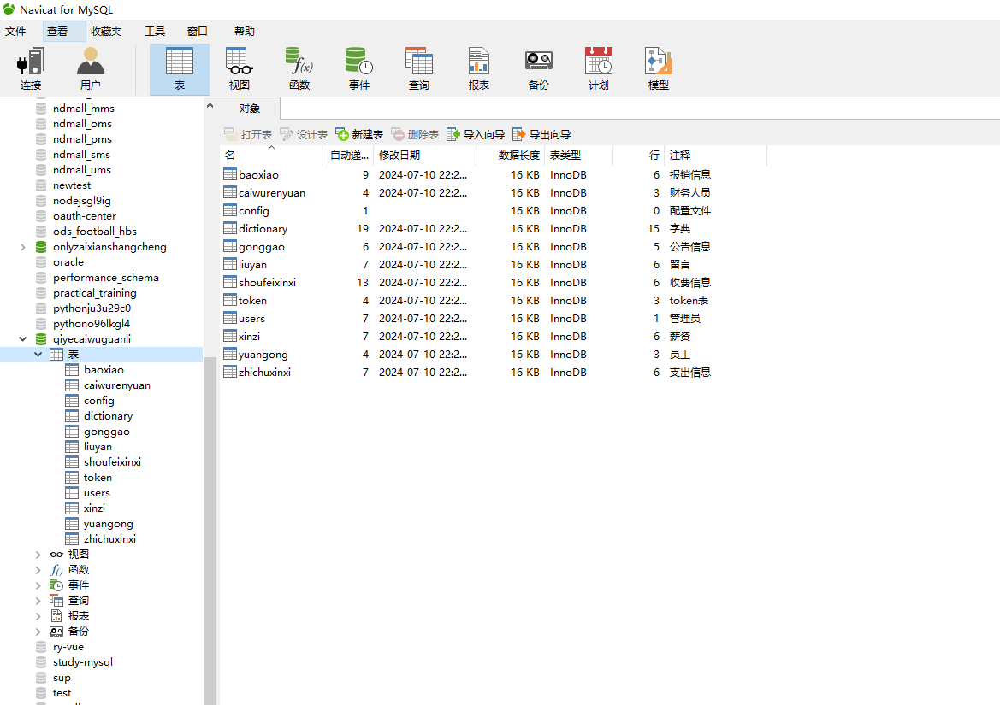

# 基于springboot的纺织品企业财务管理系统

---
### 👉作者QQ ：1556708905 微信：zheng0123Long (支持定制修改、部署调试、定制毕设)

### 👉接网站建设、小程序、H5、APP、各种系统等

---

#### 介绍

在当今竞争激烈的商业环境中，财务管理对于纺织品企业的稳定发展至关重要。为了提高企业财务管理的效率和准确性，实现财务流程的规范化和信息化，我们开发了这套基于 Spring Boot 的纺织品企业财务管理系统。该系统旨在为企业提供一个全面、高效、便捷的财务管理平台，满足不同角色在财务工作中的需求。

#### 技术栈

后端技术栈：Springboot+Mysql+Maven

前端技术栈：Vue+Html+Css+Javascript+ElementUI

开发工具：Idea+Vscode+Navicate

#### 系统功能介绍

（一）管理端  
个人中心：管理端用户可以在个人中心查看和修改个人信息，接收系统通知和重要消息。  
财务人员管理：对财务人员的信息进行管理，包括添加、删除、修改财务人员的账号信息，设置财务人员的权限和职责等。  
报销信息管理：审核和管理员工的报销申请，包括查看报销明细、审批报销金额、确认报销状态等。  
基础数据管理：维护系统所需的基础数据，如财务科目设置、费用类型定义、税率设定等，为财务核算和报表生成提供数据支持。  
公告信息管理：发布和管理企业内部的财务相关公告，如财务制度更新、报销流程变更等，确保员工及时了解财务政策的变化。  
留言管理：查看和回复员工在财务管理方面的留言和咨询，解决员工的疑问和问题。  
收费信息管理：记录企业的各项收费情况，包括客户订单的收款、其他业务的收费等，确保资金流入的准确记录。  
支出信息管理：管理企业的各项支出，如原材料采购支出、员工薪酬支出、设备维护支出等，监控企业的资金流出情况。  
薪资管理：负责制定和调整员工的薪资结构、计算员工的工资和奖金，以及处理薪资发放相关的事务。  
员工管理：对企业员工的基本信息进行管理，包括员工档案的建立、修改、查询等，同时可以关联员工的财务相关数据。  

（二）财务人员端  
个人中心：同管理端，财务人员可在个人中心进行个人信息的查看与修改。  
报销信息：处理员工的报销申请，包括初步审核报销单据的真实性和合规性，填写审核意见等。  
公告信息管理：协助管理端发布和更新财务公告，确保公告的及时传达和落实。  
收费信息管理：负责具体的收费操作，如开具收款凭证、记录收款方式和时间等。  
支出信息管理：执行各项支出的审批和支付流程，保证支出的合理性和合法性。  
薪资管理：协助管理端进行薪资的计算和发放工作，如核对考勤数据、计算绩效工资等。  

（三）员工端  
个人中心：员工可以在个人中心查看个人基本信息和财务相关的记录。  
报销信息管理：提交报销申请，上传报销凭证，跟踪报销进度。  
公告信息管理：查看企业发布的财务公告，了解财务政策和流程的变化。  
留言管理：向财务部门留言咨询财务相关问题，提出意见和建议。  
薪资管理：查看个人的薪资明细，包括工资构成、扣除项目、发放时间等。  

#### 系统作用

提高财务管理效率  
实现财务流程的自动化和信息化，减少人工操作和纸质文件的传递，大大提高了财务工作的效率。  
增强财务数据准确性  
避免了人工计算和记录可能产生的错误，保证了财务数据的准确性和可靠性。  
规范财务流程  
明确了各个财务环节的操作流程和审批权限，使财务管理更加规范化和标准化。  
提升决策支持能力  
为管理层提供及时、准确的财务数据和分析报告，有助于制定科学的经营决策。  
增强员工满意度  
员工可以方便地查询个人财务信息和进行报销申请，提高了员工对企业财务管理的满意度。  

#### 系统功能截图

代码结构

数据库表

登录

财务人员管理

报销信息管理

留言管理

收费信息管理

支出信息管理

薪资管理

员工管理

财务管理人员端收藏信息

薪资管理

员工端报销信息

#### 总结

基于 Spring Boot 的纺织品企业财务管理系统，通过区分管理端、财务人员端和员工端的不同功能，实现了财务管理的精细化和协同化。该系统有助于优化企业财务流程，提高财务工作效率，为企业的发展提供有力的财务支持和保障。

#### 使用说明

创建数据库，执行数据库脚本 修改jdbc数据库连接参数 下载安装maven依赖jar 启动idea中的springboot项目

后台登录页面
http://localhost:8080/qiyecaiwuguanli/admin/dist/index.html

管理员				账户:admin 		密码：admin

财务人员				账户:a3 		密码：123456

员工				账户:a1 		密码：123456